# ReadinessTracker

iOS readiness app. Bright Apple Health UI. Local HealthKit plus optional Fitbit. WHOOP product surfaces via Apple Health. No unofficial WHOOP OAuth.

**main:** Gym / Work / Sleep rings use Apple Activity packing with a center READY score in a Fitness-scale hole; legend opens Fitness-style ring detail. Today Strain/Recovery Balance shows Recovery | Strain with deltas and a 7-day recovery spark. Watch strain page mirrors WHOOP dual Recovery|Strain arcs. Sleep Performance shows Need | Got dual metrics. Recommendations use WHOOP-style actionable cards. Today scroll keeps Morning and Evening above the tab bar. Body sits above the WHOOP stack with Fitness-style progress tiles and tap-through detail. History Browse Trends opens Health-style trend detail with summary stats and scrub. Day Detail / Sleep Analysis show WHOOP night-detail chrome (stage % chips, hypnogram, cycles summary).

Screenshots are Simulator captures from `./scripts/capture-surfaces.sh` (XCUITest swipe plus `-ui-fixture`, not VoiceOver).

## Status

| Surface | Status | Evidence |
|---|---|---|
| Today hero, Gym / Work / Sleep rings | Shipped. Concentric Activity geometry (`size/10` stroke, gap 2), packed center READY score, one `-90` start, round caps, no tip dots, no hairline halo | [verify-rings.png](.audit/verify-rings.png) |
| Ring detail (Gym / Work / Sleep) | Shipped. Legend taps open Fitness-style sheet: score, matching color/label, 7-day sparkline + mini bars from fixture history (Gym→workoutMinutes, Work→hrv, Sleep→sleepHours) | [verify-ring-detail.png](.audit/verify-ring-detail.png) |
| Source chips + **WHOOP via Apple Health** | Shipped | [verify-dashboard.png](.audit/verify-dashboard.png) |
| Morning / Evening check-in cards | Shipped. First screen ends at the sync bar. Scrolled Today shows both cards above the tab bar. Morning/Evening stay on one line on the half-card | dashboard + body frames |
| Check-in tab (Morning / Evening form) | Shipped. Dedicated capture opens the Check-in tab (segmented picker + Save) | [verify-checkin.png](.audit/verify-checkin.png) |
| History tab (Weekly Report + Trends) | Shipped. Dedicated capture opens the History tab (source picker, Weekly Report, Trends) | [verify-history.png](.audit/verify-history.png) |
| History Trends detail (Health Browse) | Shipped. Browse Trends → period chips, Avg/Min/Max/Change summary, drag scrub on multi-metric chart | [verify-trends.png](.audit/verify-trends.png) |
| Day Detail / Sleep Analysis (WHOOP night) | Shipped. Asleep | In Bed | Efficiency header, stage % chips, hypnogram, cycles summary | [verify-day-detail.png](.audit/verify-day-detail.png) |
| Recovery / Strain wheel | Shipped. Dual concentric arcs (outer Strain 0–21, inner Recovery 0–100%), value labels, WHOOP colors; shared on Today + Recovery & Strain detail | [verify-strain-wheel.png](.audit/verify-strain-wheel.png) |
| Strain / Recovery balance (Today) | Shipped. Side-by-side Recovery % \| Strain /21 with day-over-day deltas; tappable → Recovery & Strain detail; 7-day recovery spark under the wheel | [verify-strain-recovery.png](.audit/verify-strain-recovery.png) |
| Recommendations (Today) | Shipped. WHOOP-style actionable cards (title, reason, action cue); training rules + coaching fill ≥1–3 under `-ui-fixture` | [verify-recommendations.png](.audit/verify-recommendations.png) |
| Coaching (Settings) | Shipped. Ranked insight cards with explanation + action; dedicated capture from Settings → Coaching | [verify-coaching.png](.audit/verify-coaching.png) |
| Sleep Performance (14-night need) | Shipped. Need \| Got dual metric + comparative bar (14-night need); Efficiency and Consistency stay one line | [verify-sleep-performance.png](.audit/verify-sleep-performance.png) |
| Sleep HRV (RMSSD) | Shipped. Tonight \| Baseline dual callout, delta, baseline band, 7-night sparkline; Sleep Quality one-liner | [verify-sleep-hrv.png](.audit/verify-sleep-hrv.png) |
| Respiratory Rate | Shipped. Tonight \| Baseline dual callout, % delta, ±10% baseline band, 7-night sparkline | [verify-respiratory.png](.audit/verify-respiratory.png) |
| Skin Temperature | Shipped. Tonight \| Baseline dual callout, °C delta, ±0.3°C baseline band, 7-night sparkline | [verify-skin-temp.png](.audit/verify-skin-temp.png) |
| Sleep Debt | Shipped. Debt \| Last night dual hours, zero-centered gauge, payback cue, 7-night balance spark + daily vs need bars | [verify-sleep-debt.png](.audit/verify-sleep-debt.png) |
| Sleep Quality / Consistency cards | Shipped. Elevated score rings, bedtime dots/bars, 7-day quality + consistency sparklines | [verify-sleep-quality.png](.audit/verify-sleep-quality.png) |
| Body & activity (steps, Activity min, calories, SpO2, water, caffeine, protein) | Shipped, **above** the WHOOP stack. Elevated tiles: progress-to-goal + 7-day spark; tap → metric detail. Label is Activity, not Heart Points | [verify-body-activity.png](.audit/verify-body-activity.png) · [verify-body-detail.png](.audit/verify-body-detail.png) |
| Sleep disturbance count on Today sleep row | Shipped. Dedicated capture scrolls Today to Sleep Stages (“1 disturbance” under `-ui-fixture`) | [verify-sleep-disturbances.png](.audit/verify-sleep-disturbances.png) |
| Journal (seeded entries under fixture) | Shipped. `-ui-fixture` seeds ≥7 journal entries; capture opens Journal from Today (Recent Entries) | [verify-journal.png](.audit/verify-journal.png) |
| Journal Behavior Impact chart | Shipped. Fixture seed unlocks habit↔readiness impact (≥7 days); empty “Log 7 days” strip remains for real users with fewer entries | [verify-journal-impact.png](.audit/verify-journal-impact.png) |
| Weekly Report sheet (History) | Shipped. Dedicated capture opens History → Weekly Report (≥3 fixture days) | [verify-weekly-report.png](.audit/verify-weekly-report.png) |
| Sleep Analysis hypnogram (fixture stages) | Shipped. Fixture seeds coherent `sleepStages` (one awake) aligned with `wakeEpisodes`; capture opens Today → Sleep Stages → Sleep Analysis | [verify-sleep-stages.png](.audit/verify-sleep-stages.png) |
| Settings connect / reconnect + cycle toggle off | Shipped | [verify-settings-sources.png](.audit/verify-settings-sources.png) |
| Metric detail chart scrub (date + value callout) | Shipped. Drag scrub on `AdvancedMetricChartView` (score breakdown → detail): RuleMark + tooltip; period selector 7D/30D/90D/1Y; Reduce Motion skips scrub haptics | [verify-metric-detail-scrub.png](.audit/verify-metric-detail-scrub.png) |
| Classic `MetricDetailView` primary Trend scrub | Shipped. Today → Metrics cards open classic detail; `ChartScrubSelection` drag scrub + RuleMark/`ChartTooltip` on primary Trend chart (parity with Advanced) | [verify-metric-detail-classic-scrub.png](.audit/verify-metric-detail-classic-scrub.png) |
| Home Screen widget (Gym / Work / Sleep) | Shipped. Small + medium + **large** + **extra large** use Fitness-style `CompactTripleRingsView`; large adds Gym/Work/Sleep rows + HRV/RHR/Sleep hours; extra large (iPad / StandBy) extends large with readiness cue + G/W/S metric tiles; medium/large/extra-large show interactive **Check-in** / **Evening** / **Trends** (`Link` → `readinesstracker://checkin/{morning|evening}` + `readinesstracker://trends`) and Fitness-style live **Updated …** (`Text(..., style: .relative)`) from App Group `lastUpdate` (getSnapshot shares App Group load with timeline) | [verify-home-widget.png](.audit/verify-home-widget.png) · [verify-home-widget-large.png](.audit/verify-home-widget-large.png) · [verify-home-widget-extra-large.png](.audit/verify-home-widget-extra-large.png) · [verify-home-widget-updated.png](.audit/verify-home-widget-updated.png) · [verify-home-widget-live-updated.png](.audit/verify-home-widget-live-updated.png) · [verify-home-widget-checkin.png](.audit/verify-home-widget-checkin.png) · [verify-home-widget-deeplinks.png](.audit/verify-home-widget-deeplinks.png) |
| Watch dashboard hero (Gym / Work / Sleep) | Shipped. Concentric Activity rings on Watch glance; `WatchSnapshot` carries gym/work/sleep from WatchConnectivity | [verify-watch-dashboard.png](.audit/verify-watch-dashboard.png) |
| Watch strain page (Recovery | Strain dual arcs) | Shipped. WHOOP dual concentric arcs (Recovery inner / Strain outer) on Watch strain page via shared `StrainRecoveryDualArcGeometry` + `CompactStrainRecoveryWheel`; uses recovery + strain from `WatchSnapshot` | [verify-watch-strain.png](.audit/verify-watch-strain.png) |
| Watch complication (Gym / Work / Sleep rings) | Shipped. WidgetKit accessory circular + **rectangular** + **inline** + **corner** Fitness-style glances in `ReadinessTrackerWatchWidgets` embedded in Watch App; rectangular mirrors Lock Screen (#33) with compact rings + readiness + short G/W/S cues; **inline** elevates colored readiness + short G/W/S (R/G/W/S) text cues within `accessoryInline` width (Lock #34 / rect #44 parity); **corner** keeps compact rings (#44) and elevates `widgetLabel` to colored readiness + short G/W/S cues (inline #45 / `WatchAccessoryCue` parity); timeline from App Group `lastWatchSnapshot` written by iOS `WatchConnectivityManager` / `WidgetDataExporter` + Watch `WatchSessionManager` mirror; iOS prefers WC `transferCurrentComplicationUserInfo` when budget remains **and** glance fields changed (else context/message; App Group always); Watch persist soft-fail reloads `ReadinessWatchComplication` timelines (**portal App Group enable remains manual** in `DEVICE_SETUP.md`) | [verify-watch-complication.png](.audit/verify-watch-complication.png) · [verify-watch-complication-rectangular.png](.audit/verify-watch-complication-rectangular.png) · [verify-watch-complication-inline.png](.audit/verify-watch-complication-inline.png) · [verify-watch-complication-corner.png](.audit/verify-watch-complication-corner.png) |
| Lock Screen circular + rectangular + inline (Gym / Work / Sleep) | Shipped. `accessoryCircular` + `accessoryRectangular` use Fitness-style `CompactTripleRingsView` (rectangular: compact rings + readiness score + short G/W/S cues); `accessoryInline` is a compact text glance (readiness score + short G/W/S cues) | [verify-lock-widget.png](.audit/verify-lock-widget.png) · [verify-lock-widget-rectangular.png](.audit/verify-lock-widget-rectangular.png) · [verify-lock-widget-inline.png](.audit/verify-lock-widget-inline.png) |
| Official WHOOP API | Out of scope | Settings copy says so |
| Google Fit REST / “Heart Points” | Out of scope | Activity = minutes + calories |

## Supported features

Four tabs stay Today, History, Check-in, and Settings.

**Data.** Apple Health (HealthKit) is the default source. Fitbit is optional OAuth via gitignored `Secrets.xcconfig`. WHOOP values appear when the user shares WHOOP into Apple Health. `DataSource` is appleWatch or fitbit only.

**Today.** Readiness hero with Gym / Work / Sleep rings (`TripleRingHero`); legend opens Fitness-style ring detail. Morning and Evening check-in. Journal. Recommendations. Body and activity (steps, Activity minutes, calories, SpO2, water, caffeine, protein) with progress-to-goal tiles and tap-through detail. WHOOP stack (Recovery, Strain, Sleep Performance, Sleep HRV, Sleep Debt, Sleep Quality, Sleep Consistency, Respiratory Rate, Skin Temperature). Sleep stages with disturbance count. Trends and score breakdown.

**Scores.** Recovery 0-100 from `RecoveryCalculator`. Strain TRIMP 0-21. Sleep need is the 14-night average from `BaselineManager`. HRV is RMSSD. Wheel recovery uses `RecoveryCalculator.dashboardWheelScore`.

**Check-in and journal.** Morning and Evening cards open Check-in for that time. Journal impact chart waits for 7 days of entries (seeded under `-ui-fixture`).

**Settings.** Apple Health Connect / Reconnect. Fitbit Connect / Refresh / Disconnect. Cycle tracking off by default. CSV export. Coaching and notification screens.

**Elsewhere.** History with weekly report. Home screen widgets (small / medium / large) with Fitness-style Check-in / Evening / Trends deep links on medium/large, Lock Screen circular + rectangular (Fitness-style Gym/Work/Sleep triple rings), Watch dashboard (Fitness-style Gym/Work/Sleep triple rings), and Watch strain (WHOOP Recovery|Strain dual arcs) plus Watch complications (Fitness-style Gym/Work/Sleep circular + rectangular rings via Watch Widgets extension).

**Not in this app.** Unofficial WHOOP login. Google Fit REST. Heart Points.

## App surfaces

### Today

Bright grouped background. Dark selected Apple Watch chip. WHOOP-via-Health caption. Readiness 90 / Ready to perform. Rings match Activity packing. Sync bar sits above the tab bar.


### Triple rings

Same first screen, captured for ring geometry. Concentric Activity diameters; center READY typography packs into a Fitness-Summary-scale hole (no longer an oversized empty core).


### Ring detail

Tap Gym / Work / Sleep on the hero legend. Sheet shows that ring’s score, matching color/label, and a 7-day sparkline + mini bars from `UIFixture` history (Gym → workout minutes, Work → HRV, Sleep → sleep hours).


### Recovery, sleep performance, HRV

Scrolled Today after Body. Need caption is the 14-night average. Efficiency and Consistency do not wrap mid-word.


### Sleep Performance (Need vs Got)

WHOOP-like Sleep Performance card on Today: side-by-side **Need** and **Got** hours (14-night average vs last night), comparative bar with need marker, performance % ring. Efficiency / Consistency remain compact one-liners.


Tonight vs Baseline dual metric (ms RMSSD), % delta badge, ±10% baseline band on the trend chart, and a compact 7-night sparkline. Sleep Quality stays a one-liner. Metric-detail scrub for HRV already exists elsewhere.


### Respiratory Rate & Skin Temperature

WHOOP-like Tonight vs Baseline dual metrics on Today: Respiratory Rate (breaths/min, % delta, ±10% band, 7-night spark) and Skin Temperature (°C delta, ±0.3°C band, 7-night spark). Full-width cards under the Strain/Recovery balance row.

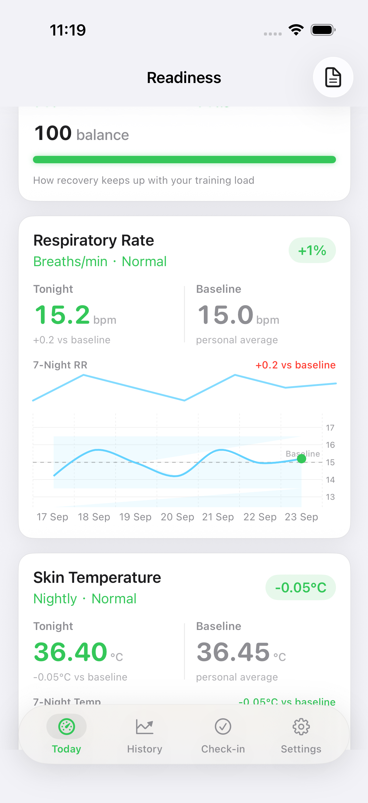

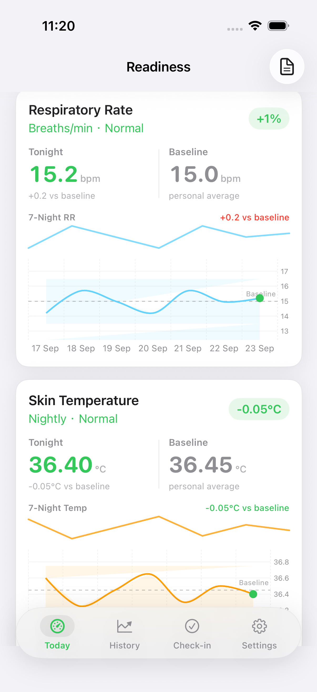

### Recovery / Strain wheel

WHOOP-like dual concentric arcs on Today (and Recovery & Strain detail): outer Strain 0–21, inner Recovery 0–100%, independent fills from the top, Recovery % in the center, Recovery | Strain value legend under the wheel.

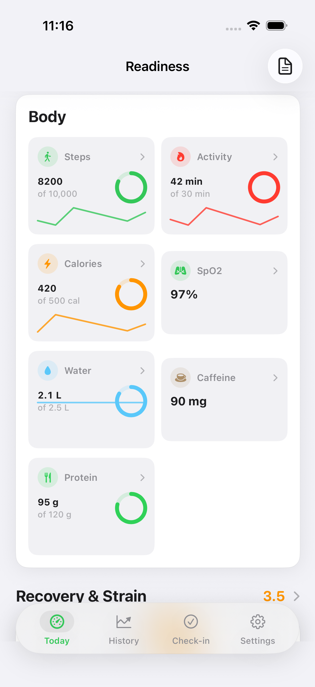

### Strain / Recovery balance

WHOOP-like Balance card on Today: Recovery % and Strain /21 side-by-side with day-over-day deltas, composite balance score, and tap-through to Recovery & Strain detail. A 7-day recovery spark sits under the wheel.


### Recommendations

Scrolled Today to Recommendations (after Journal). WHOOP-style cards with title, reason, and a concrete action cue. Under `-ui-fixture`, training rules plus coaching insights fill 1–3 cards from real fixture data (no placeholder copy).


### Coaching

Opened from Settings → Insights → Coaching. Ranked coaching feed cards (explanation + action) under `-ui-fixture` — not the empty “No coaching insights yet” state.


### Sleep debt

Scrolled Today to the elevated Sleep Debt card (after Sleep HRV, before Sleep Quality Trend): Debt | Last night dual hours, zero-centered gauge, payback cue, 7-night balance spark, and daily vs need bars.


### Sleep quality and consistency

Scrolled further on Today past Sleep Debt. Elevated Sleep Quality Trend (avg score ring + 7-day spark + bars) and Sleep Consistency (score ring, Bedtime | Wake dual %, bedtime-vs-average dots/bars, consistency spark).


### Body and activity

Sits above Recovery and Strain. Elevated Fitness / Google Health–style tiles with progress-to-goal (Steps 10k, Activity 30 min, …) and 7-day sparklines. Tap a tile for focused metric detail. Label is **Activity**, not Heart Points. Morning and Evening are fully above the tab bar in this frame.


### Body metric detail

Tap Steps (or Activity / Calories / …) on Body & activity. Sheet shows today’s value, optional goal ring, and Last 7 days sparkline + mini bars from fixture history.


### Metric detail chart scrub

Today → Sleep (or HRV/RMSSD) metric card opens `MetricDetailView`. Drag across the primary Trend chart to inspect date + value (Apple Health / WHOOP style). Period selector matches Health-like 7D / 30D / 90D / 1Y controls. Score breakdown rows still open `AdvancedMetricDetailView` (bands / MA / outliers).


### Settings, data sources

Apple Health connected plus Reconnect. Fitbit Connect with missing-secrets error (expected without `Secrets.xcconfig`). Cycle tracking off.


### Check-in tab

Dedicated Check-in tab (not the Today Morning/Evening cards). Segmented Morning/Evening picker, Physical State form, and Save under `-ui-fixture`.


### History tab

Dedicated History tab. Segmented Apple Watch / Fitbit source picker, Weekly Report row, Trends section, and day list under `-ui-fixture` (14 seeded Apple Watch days).


### History Trends detail

Tap **Browse Trends** on History. Health Browse–style `TrendDetailView`: period chips (7D/30D/90D/1Y), Avg / Min / Max / Change % summary for the primary metric, drag-to-inspect scrub on the multi-metric chart (parity with Metric detail scrub).

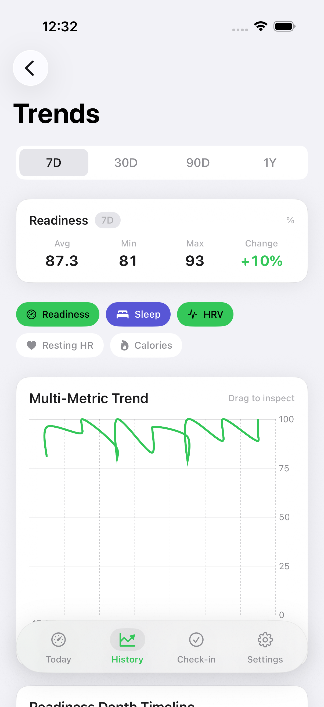

### Day Detail / Sleep Analysis (WHOOP night)

History day row opens `DayDetailView` with WHOOP night-detail clarity: sleep score + Asleep | In Bed | Efficiency header, stage % chips, Sleep Timeline hypnogram, and cycles summary (Full Sleep Analysis retained). Today → Sleep Stages opens the same elevated chips + hypnogram on `SleepAnalysisView`.

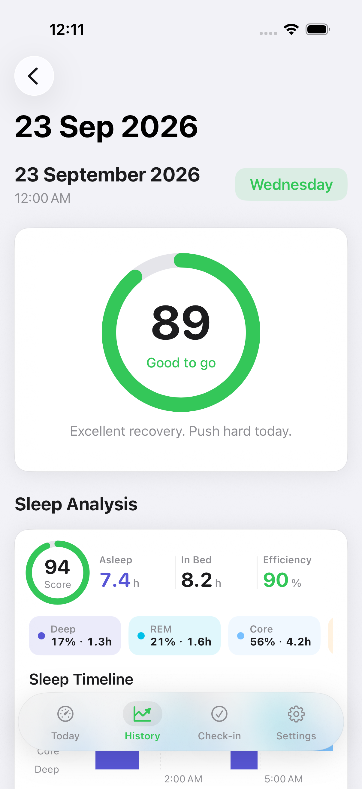

### Weekly Report

Opened from History’s Weekly Report row. Sheet shows avg readiness, trend, stat grid, Highlights/Recommendations, and Share Report under `-ui-fixture` (14 seeded days → generator needs ≥3).


### Journal

Opened from Today’s Journal row. Under `-ui-fixture`, ≥7 seeded entries show Recent Entries (real users with fewer than 7 days still see the empty “Log 7 days…” strip).


### Journal Behavior Impact

Same Journal screen scrolled to the Behavior Impact card. Fixture habits (alcohol, caffeine, recovery) line up with readiness scores so the chart is non-empty.


### Sleep disturbances

Scrolled Today to the Sleep Stages card. Fixture derives `wakeEpisodes` from one awake stage interval so “1 disturbance” matches hypnogram / Day Detail (accessibility label “Sleep disturbances”).


### Sleep stages hypnogram

Opened from Today’s Sleep Stages card into Sleep Analysis. Under `-ui-fixture`, seeded stage intervals render the Sleep Timeline hypnogram (not the empty “No detailed stage data” state), with disturbance count derived from those stages.


### Watch dashboard

Fitness-style Gym / Work / Sleep concentric rings on the Watch glance hero (parity with Today + Home widget). Scores arrive on `WatchSnapshot` via WatchConnectivity.

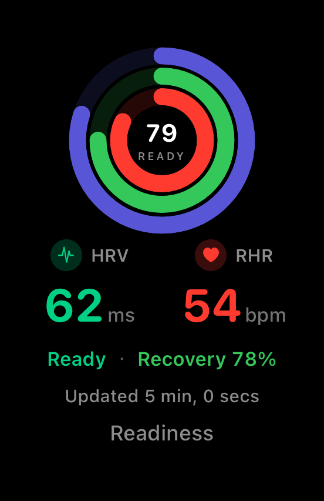

### Watch strain

WHOOP dual concentric arcs on the Watch strain page (Recovery inner / Strain outer), matching Today `StrainRecoveryWheel` colors and labels. Shared `StrainRecoveryDualArcGeometry` + `CompactStrainRecoveryWheel` (Watch App target membership); recovery % and strain 0–21 come from `WatchSnapshot`.

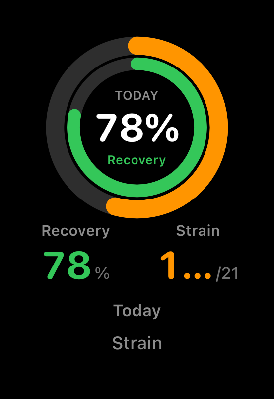


### Watch complication

Fitness-style Gym / Work / Sleep concentric rings on Watch face complications (`accessoryCircular` + `accessoryRectangular` + `accessoryInline` + `accessoryCorner`). Rectangular elevates to Lock Screen parity (#33/#44): compact triple rings + readiness score + short G/W/S cues; **inline** elevates colored readiness + short G/W/S (R/G/W/S) text cues within the narrow `accessoryInline` slot (Lock #34 / rect #44 parity); **corner** keeps compact rings (#44) and elevates `widgetLabel` to colored readiness + short G/W/S cues (`WatchAccessoryCue` / inline #45 parity). Shipped as `ReadinessTrackerWatchWidgets` (WidgetKit) embedded in the Watch App; scores come from App Group `lastWatchSnapshot` written on iOS by `WatchConnectivityManager` / `WidgetDataExporter` (`WatchSnapshotAppGroupStore`) and mirrored on Watch by `WatchSessionManager`, which soft-fail reloads `ReadinessWatchComplication` timelines after persist (Honest #37). Phone→Watch delivery prefers `WCSession.transferCurrentComplicationUserInfo` when `remainingComplicationUserInfoTransfers > 0` **and** glance-relevant fields changed (readiness/gym/work/sleep + recovery/strain fingerprint; Honest #39), else application context / reachable message (Honest #38); App Group write always runs. Watch `didReceiveUserInfo` shares the persist+reload path. App Group portal enable remains manual — see `docs/DEVICE_SETUP.md`.

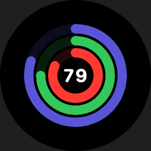

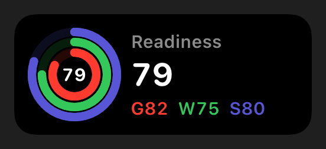


### Lock Screen circular

`accessoryCircular` Lock Screen widget uses the same Fitness-style Gym / Work / Sleep concentric rings as Home + Watch (`CompactTripleRingsView` / `TripleRingGeometry`, scaled for the accessory slot).

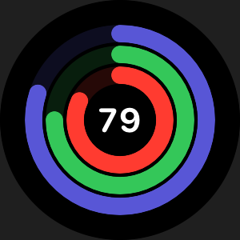

### Lock Screen rectangular

`accessoryRectangular` Lock Screen widget elevates to the same Fitness-style glance: compact triple rings + readiness score, with short Gym / Work / Sleep cues when they fit the accessory bounds (`CompactTripleRingsView` / `TripleRingGeometry`).

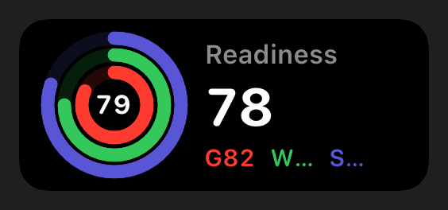

### Lock Screen inline

`accessoryInline` Lock Screen widget adds the Fitness / Health-style glance beside Lock Screen time: readiness score plus short Gym / Work / Sleep cues in a single compact text line (`AccessoryInlineWidgetView`).


### Home Screen large

`.systemLarge` Home widget mirrors Fitness / Health glance density: `CompactTripleRingsView` plus Gym / Work / Sleep score rows and HRV / RHR / Sleep hours (same Medium patterns). Medium and large expose Fitness-style deep-link controls: **Check-in** (`readinesstracker://checkin/morning`), **Evening** (`…/evening`), and **Trends** (`readinesstracker://trends` → History browse), plus **Updated …** freshness from App Group `lastUpdate`.

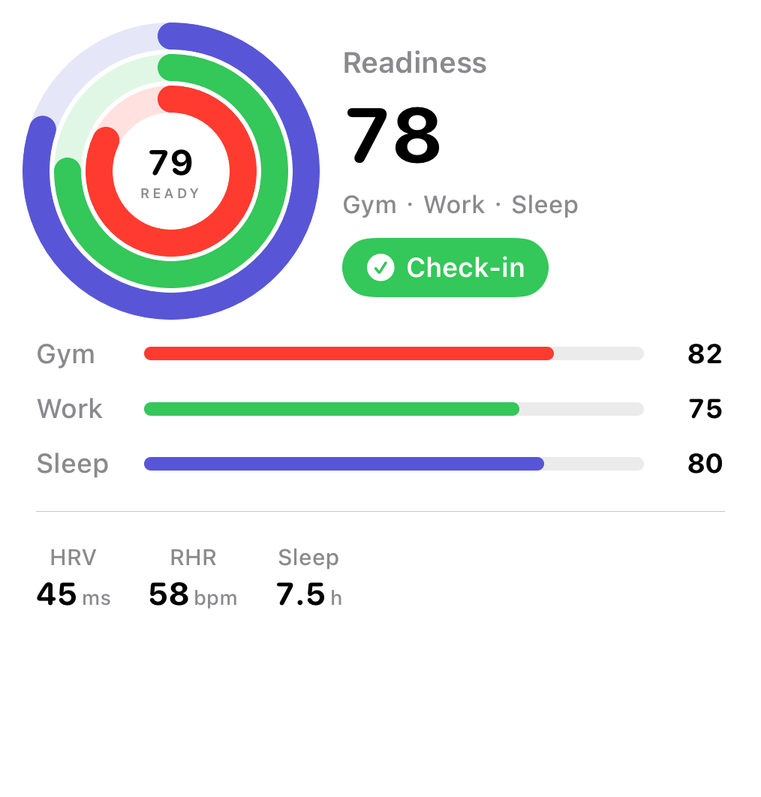

### Home Screen extra large

`.systemExtraLarge` (iOS 15+ / iPad & StandBy) extends large with Fitness-style density: larger `CompactTripleRingsView`, readiness High/Moderate/Low cue, Gym/Work/Sleep rows, HRV/RHR/Sleep hours, plus G/W/S metric tiles. Keeps Check-in / Evening / Trends deep links (parity with large) and **Updated …** freshness.

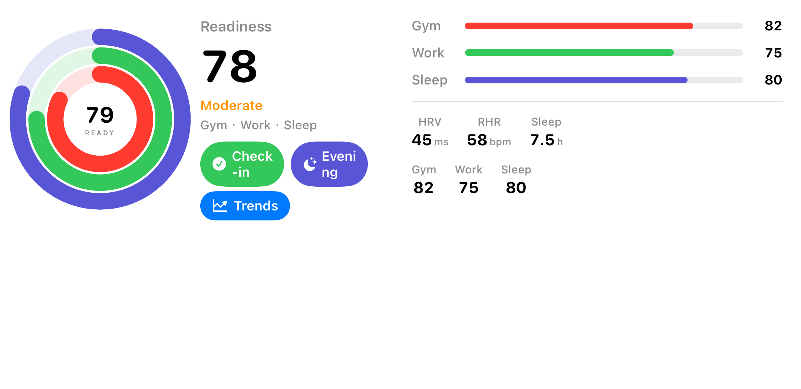

### Home Screen Updated freshness

Medium / large / extra-large Home widgets surface Fitness-style live **Updated …** (`Text(..., style: .relative)`) from App Group `lastUpdate` (`WidgetDataExporter`); `getSnapshot` shares the App Group loader with `getTimeline`. Cue hides gracefully when the key is missing. Lock accessories stay uncluttered.

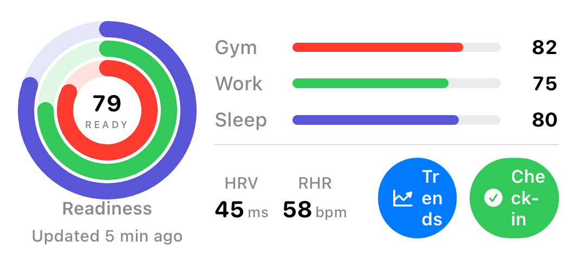
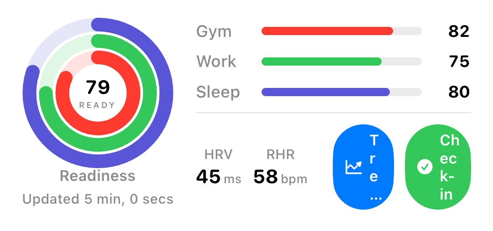

### Home Screen Check-in control

Medium + large chrome with the interactive Check-in capsule (small uses `.widgetURL` only). Deep link handled by `AppDeepLink` → Check-in tab / Morning.

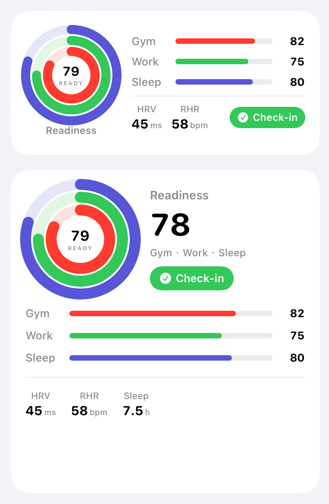

### Home Screen Evening + Trends deep links

Medium secondary **Trends** `Link`; large shows Check-in / Evening / Trends. `AppDeepLink` routes Evening → Check-in tab and Trends → History tab.

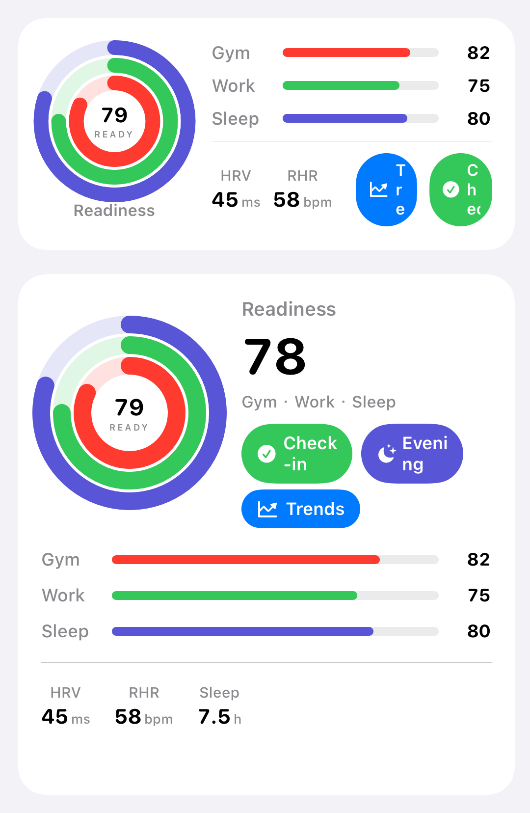

## Verify

Push and pull request to `main` run three required GitHub Actions jobs.

1. Tree guard (`./scripts/ci-guard-tree.sh`). Fails if git tracks `build/`, `Readiness.app`, `Secrets.xcconfig`, `xcuserdata`, or `Heart Points` in Swift. Also fails if a committed `.audit/verify-*.png` is missing.
2. iOS unit tests (`./scripts/ci-verify.sh`). `ReadinessTrackerTests` only.
3. iOS UI surfaces (`./scripts/capture-surfaces.sh`). UITests with `-ui-fixture` (including classic MetricDetailView scrub). PNGs upload as the `ui-surfaces` artifact.

```bash
./scripts/ci-guard-tree.sh

DESTINATION='platform=iOS Simulator,name=iPhone 17 Pro' ./scripts/ci-verify.sh

DESTINATION='platform=iOS Simulator,name=iPhone 17 Pro' ./scripts/capture-surfaces.sh
```

Do not commit `build/`, `build-DD/`, `Readiness.app`, or `Secrets.xcconfig`. The build recipe is `ReadinessTracker.xcodeproj` plus `scripts/*.sh`. There is no Makefile.

## Setup

- HealthKit on device. WHOOP data appears when the user shares WHOOP to Apple Health.
- Fitbit: copy `Secrets.xcconfig.example` to `Secrets.xcconfig`. See `FITBIT_SETUP.md` and `docs/DEVICE_SETUP.md`.
- App Group `group.com.readinesstracker` for widgets. See `docs/DEVICE_SETUP.md`.

## Honest gaps

1. ~~Fifth capture frame for Sleep HRV chips plus Sleep Quality / Consistency cards.~~ Closed — [verify-sleep-quality.png](.audit/verify-sleep-quality.png) from `testSleepQualitySurfaceVisibleAfterScroll`.
2. ~~Morning wraps on the half-width check-in card.~~ Closed — Morning/Evening use `lineLimit(1)` + `minimumScaleFactor` on the half-width cards.
3. ~~Center “90 READY” makes a larger inner hole than Fitness Summary, which has no center score.~~ Closed — tighter Activity packing (`size/10` stroke, gap 2) plus scaled center READY typography; see [verify-rings.png](.audit/verify-rings.png).
4. ~~Sleep Debt Status row was “Present further down | UITest” with no dedicated frame.~~ Closed — [verify-sleep-debt.png](.audit/verify-sleep-debt.png) from `testSleepDebtSurfaceVisibleAfterScroll`.
5. ~~Check-in tab had no dedicated UITest/PNG (only Today Morning/Evening cards).~~ Closed — [verify-checkin.png](.audit/verify-checkin.png) from `testCheckInTabSurface`.
6. ~~History tab had no dedicated UITest/PNG (only mentioned under Elsewhere).~~ Closed — [verify-history.png](.audit/verify-history.png) from `testHistoryTabSurface`.
7. ~~Journal “log 7 days” strip Status row cited `JournalView` with no PNG.~~ Closed — [verify-journal.png](.audit/verify-journal.png) from `testJournalSurface` (fixture now seeds ≥7 entries; empty strip remains for real users with <7 days).
14. ~~Journal Behavior Impact chart only showed after 7 real days; fixture permanently showed “Log 7 days…”.~~ Closed — `UIFixture.seedJournalEntries` (≥8 entries with readiness scores); [verify-journal-impact.png](.audit/verify-journal-impact.png) from `testJournalImpactSurface`.
8. ~~Sleep disturbance count Status row cited `DashboardView` with no PNG.~~ Closed — [verify-sleep-disturbances.png](.audit/verify-sleep-disturbances.png) from `testSleepDisturbanceSurfaceVisibleAfterScroll`.
9. ~~Weekly Report sheet had History row only (no PNG of the report itself).~~ Closed — [verify-weekly-report.png](.audit/verify-weekly-report.png) from `testWeeklyReportSurface`.
10. ~~UIFixture set `wakeEpisodes: 1` with empty `sleepStages`, so Today showed “1 disturbance” while Sleep Analysis / Day Detail hypnogram and `awakePeriods(from:)` were empty; hypnogram Y also used positive `depthRank` outside `chartYScale` `-4...0`.~~ Closed — fixture seeds coherent stages (one awake) and derives `wakeEpisodes` from them; HypnogramView uses negated Y bands; [verify-sleep-stages.png](.audit/verify-sleep-stages.png) from `testSleepStagesSurface`.
11. ~~Metric detail trend charts were tap-only (or no scrub callout) vs Apple Health / WHOOP drag-to-inspect.~~ Closed — `AdvancedMetricChartView` drag scrub + RuleMark/tooltip; [verify-metric-detail-scrub.png](.audit/verify-metric-detail-scrub.png) from `testMetricDetailChartScrubSurface`; unit tests cover `ChartScrubSelection`.
12. ~~Classic `MetricDetailView` primary Trend chart remained tap-only while Advanced had Health-style scrub.~~ Closed — `ChartScrubSelection` drag scrub + RuleMark/`ChartTooltip` on `MetricDetailView`; Metrics cards open classic detail; [verify-metric-detail-classic-scrub.png](.audit/verify-metric-detail-classic-scrub.png).
13. ~~Gym / Work / Sleep legend was display-only (no Fitness-style focused ring detail).~~ Closed — legend taps open `RingDetailView` sheet (score + color + 7-day sparkline/bars); [verify-ring-detail.png](.audit/verify-ring-detail.png) from `testRingDetailSurface`.
15. ~~Today Balance card was a single abstract score (no side-by-side Strain vs Recovery, not tappable, no recovery spark under the wheel).~~ Closed — elevated `StrainRecoveryBalanceCard` + NavigationLink + 7-day spark; [verify-strain-recovery.png](.audit/verify-strain-recovery.png) from `testStrainRecoveryBalanceSurface`.
16. ~~Today Recommendations were thin title+description only (easy to miss / empty under healthy fixture); Coaching had no dedicated PNG.~~ Closed — WHOOP-style actionable cards via `morningActionableCards` (training + coaching fill); [verify-recommendations.png](.audit/verify-recommendations.png) + [verify-coaching.png](.audit/verify-coaching.png).
17. ~~Sleep Performance Status cited only “whoop frame” — Efficiency/Consistency one-liners without a clear Need vs Got morning glance or dedicated PNG.~~ Closed — elevated Need \| Got dual metric + comparative bar; [verify-sleep-performance.png](.audit/verify-sleep-performance.png) from `testSleepPerformanceSurface`.
18. ~~Body & activity tiles were plain labels (no progress-to-goal, no sparkline, no tap-through detail) vs Google Health / Fitness glance.~~ Closed — elevated `BodyMetricTile` + `BodyMetricDetailView`; [verify-body-activity.png](.audit/verify-body-activity.png) + [verify-body-detail.png](.audit/verify-body-detail.png) from `testBodyActivityVisibleAfterScroll` / `testBodyDetailSurface`.
19. ~~Sleep HRV Status cited only whoop/sleep-quality frames — thin header + chips without a clear Tonight vs Baseline glance, baseline band, 7-night spark, or dedicated PNG.~~ Closed — elevated Tonight \| Baseline dual callout + band + spark; [verify-sleep-hrv.png](.audit/verify-sleep-hrv.png) from `testSleepHRVSurface`.
20. ~~Respiratory Rate / Skin Temperature Status cited only whoop stack — thin side-by-side cards without Tonight vs Baseline, baseline band, 7-night spark, or dedicated PNGs.~~ Closed — elevated full-width Tonight \| Baseline dual callouts + band + spark; [verify-respiratory.png](.audit/verify-respiratory.png) + [verify-skin-temp.png](.audit/verify-skin-temp.png) from `testRespiratoryRateSurface` / `testSkinTemperatureSurface`.
21. ~~Sleep Quality / Consistency Status cited only the fifth capture — thin badges/bars without a clear score ring, bedtime consistency dots/bars, or sparklines.~~ Closed — elevated score rings + bedtime-vs-average dots/bars + quality/consistency sparks; [verify-sleep-quality.png](.audit/verify-sleep-quality.png) from `testSleepQualitySurfaceVisibleAfterScroll`.
22. ~~History Trends / `TrendDetailView` lacked Health Browse polish (no summary Avg/Min/Max/Change, no drag scrub on multi-metric chart, History Trends was preview-only).~~ Closed — elevated summary + scrub; History **Browse Trends** → detail; [verify-trends.png](.audit/verify-trends.png) from `testTrendsDetailSurface`.
23. ~~Day Detail / Sleep Analysis lacked WHOOP night-detail clarity (no stage % chips, hypnogram buried, no cycles summary, thin sleep header).~~ Closed — elevated header metrics + stage chips + hypnogram + cycles; [verify-day-detail.png](.audit/verify-day-detail.png) from `testDayDetailSurface`.
24. ~~Sleep Debt Status cited only a dedicated scroll capture — cumulative chart + mini bars without a clear debt-hours graphic, payback cue, or 7-night spark.~~ Closed — elevated Debt | Last night dual hours + zero-centered gauge + payback cue + 7-night spark/bars; [verify-sleep-debt.png](.audit/verify-sleep-debt.png) from `testSleepDebtSurfaceVisibleAfterScroll`.
25. ~~Today `StrainRecoveryWheel` was a single-ring sequential Recovery→Strain gauge (not WHOOP dual concentric arcs; detail view already had dual rings inline).~~ Closed — elevated concentric dual arcs + value labels; shared via `StrainRecoveryWheel` on Today + detail; [verify-strain-wheel.png](.audit/verify-strain-wheel.png) from `testStrainRecoveryWheelSurface`.
26. ~~Home Screen `SmallWidgetView` was a single readiness ring (Today hero already uses concentric Gym/Work/Sleep Activity rings).~~ Closed — Fitness-style `CompactTripleRingsView` on small + medium left score via shared `TripleRingGeometry`; [verify-home-widget.png](.audit/verify-home-widget.png) from `Scripts/capture-home-widget.sh` (ImageRenderer of widget chrome; geometry unit-tested).
27. ~~Watch `WatchDashboardView` was a single `ScoreRing` (Home widget + iPhone Today already use concentric Gym/Work/Sleep).~~ Closed — Fitness-style `CompactTripleRingsView` on Watch dashboard via shared `TripleRingGeometry` (Watch App target membership); `WatchSnapshot` + `WatchConnectivityManager` push gym/work/sleep; [verify-watch-dashboard.png](.audit/verify-watch-dashboard.png) from `Scripts/capture-watch-dashboard.sh` (ImageRenderer of watch chrome; Watch sim build verified when available).
28. ~~Lock Screen `AccessoryCircularWidgetView` was a single `.accessoryCircularCapacity` gauge (Home + Watch + Today already use concentric Gym/Work/Sleep).~~ Closed — Fitness-style `CompactTripleRingsView` on `accessoryCircular` via shared `TripleRingGeometry` (scaled for accessory; rectangular kept with ring-color digit align); [verify-lock-widget.png](.audit/verify-lock-widget.png) from `Scripts/capture-lock-widget.sh` (ImageRenderer of Lock Screen chrome; geometry unit-tested).
29. ~~Home Screen widget supported `.systemSmall` + `.systemMedium` only (no `.systemLarge`; Fitness / Health expose large glance surfaces).~~ Closed — `LargeWidgetView` with `CompactTripleRingsView` + Gym/Work/Sleep rows + HRV/RHR/Sleep hours; `supportedFamilies` + `ReadinessWidgetView` switch; [verify-home-widget-large.png](.audit/verify-home-widget-large.png) from `Scripts/capture-home-widget-large.sh` (ImageRenderer of `HomeWidgetLargeChrome`).
30. ~~Watch `WatchStrainView` used a single `ScoreRing` for strain (iPhone Today already uses WHOOP dual concentric Recovery|Strain arcs via `StrainRecoveryWheel`).~~ Closed — elevated dual arcs (Recovery inner / Strain outer) via shared `StrainRecoveryDualArcGeometry` + `CompactStrainRecoveryWheel` (Watch App target membership); [verify-watch-strain.png](.audit/verify-watch-strain.png) from `Scripts/capture-watch-strain.sh` (ImageRenderer of `WatchStrainChrome`; Watch sim build verified when available).
31. ~~Home Screen widgets were glance-only (no Fitness-style deep-link / action into morning Check-in).~~ Closed — medium/large `Link` + `.widgetURL` (`readinesstracker://checkin/morning`); small `.widgetURL`; `AppDeepLink` + ContentView tab route; [verify-home-widget-checkin.png](.audit/verify-home-widget-checkin.png) from `Scripts/capture-home-widget-checkin.sh` (ImageRenderer of `HomeWidgetCheckInChrome`).
32. ~~App deep links stopped at morning Check-in (no Evening check-in or Trends / History browse routes from Fitness-style widget surfaces).~~ Closed — `AppDeepLink` adds `readinesstracker://checkin/evening` + `readinesstracker://trends`; medium secondary Trends + large Check-in/Evening/Trends `Link`s; [verify-home-widget-deeplinks.png](.audit/verify-home-widget-deeplinks.png) from `Scripts/capture-home-widget-deeplinks.sh` (ImageRenderer of `HomeWidgetCheckInChrome`).
33. ~~Lock Screen `AccessoryRectangularWidgetView` still showed readiness digit + Gym/Work/Sleep score rows (circular / Home / Watch already use Fitness-style `CompactTripleRingsView`).~~ Closed — elevated rectangular to compact triple rings + readiness score + short G/W/S cues via shared `TripleRingGeometry`; [verify-lock-widget-rectangular.png](.audit/verify-lock-widget-rectangular.png) from `Scripts/capture-lock-widget-rectangular.sh` (ImageRenderer of `LockScreenRectangularChrome`; geometry unit-tested).
34. ~~Lock Screen widgets shipped `accessoryCircular` + `accessoryRectangular` but `supportedFamilies` omitted `.accessoryInline` (Apple Fitness / Health often expose an inline Lock Screen glance).~~ Closed — `AccessoryInlineWidgetView` compact text glance (readiness score + short G/W/S cues); `supportedFamilies` + `ReadinessWidgetView` switch (iOS 16+); [verify-lock-widget-inline.png](.audit/verify-lock-widget-inline.png) from `Scripts/capture-lock-widget-inline.sh` (ImageRenderer of `LockScreenInlineChrome`).
35. ~~README Elsewhere mentioned Watch complications, but `ReadinessTrackerWatch/Complications/ReadinessComplication.swift` was excluded/dead (not in Watch App target) while Watch dashboard already used Fitness `CompactTripleRingsView`.~~ Closed — WidgetKit Watch Widgets extension (`ReadinessTrackerWatchWidgets`) with circular triple rings (reuse `CompactTripleRingsView` + `TripleRingGeometry`); orphan removed; [verify-watch-complication.png](.audit/verify-watch-complication.png) from `Scripts/capture-watch-complication.sh` (ImageRenderer of `WatchComplicationChrome`; Watch sim build when available).
36. ~~Watch complications read App Group `lastWatchSnapshot` with sample fallback, but iOS never wrote that suite key when pushing/updating `WatchSnapshot` (only Watch `WatchSessionManager` mirrored on receive) — data-path hole left complications on sample even when the group works.~~ Closed — iOS `WatchSnapshotAppGroupStore` writes `group.com.readinesstracker` / `lastWatchSnapshot` from `WatchConnectivityManager.pushSnapshot()` and `WidgetDataExporter.export(...)`; unit test `WatchSnapshotAppGroupStoreTests` round-trips the Codable-shaped payload. Portal App Group enable stays manual in `docs/DEVICE_SETUP.md` (no claim of live-device group without portal). Evidence: existing [verify-watch-complication.png](.audit/verify-watch-complication.png) (UI unchanged) + focused XCTest.
37. ~~After #35/#36, complications read App Group snapshot but Watch-side persist did not refresh WidgetKit timelines — updates waited for the next timeline policy.~~ Closed — `WatchSessionManager.persistSnapshotDictionary` calls `WatchComplicationTimelineReloader.reloadAfterSnapshotWrite()` (`WidgetCenter.shared.reloadTimelines(ofKind: "ReadinessWatchComplication")`, soft-fail if WidgetKit unavailable); XCTest seam `WatchComplicationTimelineReloaderTests`. Portal App Group enable stays manual. Evidence: existing [verify-watch-complication.png](.audit/verify-watch-complication.png) (UI unchanged) + `.audit/h37-unit-test-proof.txt`.
38. ~~iOS App Group writes (#36) + Watch WidgetCenter.reload (#37) still left phone→watch complication refresh dependent on WC snapshot receive / 30‑min timeline — no complication-oriented WC push.~~ Closed — iOS `WatchConnectivityManager.pushSnapshot` routes via `WatchComplicationWCPush`: prefer `WCSession.transferCurrentComplicationUserInfo` when `remainingComplicationUserInfoTransfers > 0`, else existing `updateApplicationContext` / reachable message (soft-fail if session inactive); Watch `WatchSessionManager` handles `didReceiveUserInfo` with the same persist App Group + `WatchComplicationTimelineReloader` path. XCTest seam `WatchComplicationWCPushTests`. Portal App Group enable stays manual. Evidence: existing [verify-watch-complication.png](.audit/verify-watch-complication.png) (UI unchanged) + `.audit/h38-unit-test-proof.txt`.
39. ~~After #38, every `pushSnapshot` could spend a scarce `transferCurrentComplicationUserInfo` (~50/day) even when glance scores were unchanged.~~ Closed — `WatchComplicationWCPush` throttles complication-priority transfer to glance-relevant fingerprint changes (readiness/gym/work/sleep + recovery/strain); unchanged scores still get App Group write + `updateApplicationContext` / reachable message. Last-sent fingerprint persisted via UserDefaults. XCTest seam `WatchComplicationWCPushTests` (changed→transfer vs unchanged→skip transfer). Portal App Group enable stays manual. Evidence: existing [verify-watch-complication.png](.audit/verify-watch-complication.png) (UI unchanged) + `.audit/h39-unit-test-proof.txt`.
40. ~~Home Screen widgets supported small/medium/large + Lock accessories, but omitted `.systemExtraLarge` (iOS 15+ / iPad & StandBy — Fitness/Health expose extra-large glances).~~ Closed — `ExtraLargeWidgetView` with Fitness-style `CompactTripleRingsView` + richer metrics (readiness cue, Large rows/HRV/RHR/Sleep, G/W/S tiles) + Check-in/Evening/Trends Links; `supportedFamilies` + `ReadinessWidgetView` switch; [verify-home-widget-extra-large.png](.audit/verify-home-widget-extra-large.png) from `Scripts/capture-home-widget-extra-large.sh` (ImageRenderer of `HomeWidgetExtraLargeChrome`).
41. ~~`WidgetDataExporter` already wrote App Group `lastUpdate`, but Home widget TimelineProvider / entry UI never surfaced it (Fitness/Health show “Updated …” freshness on medium+ glances).~~ Closed — `ReadinessEntry.lastUpdate` from App Group; Fitness-style **Updated …** cue on `MediumWidgetView` / `LargeWidgetView` / `ExtraLargeWidgetView` (graceful if missing; accessories stay uncluttered); [verify-home-widget-updated.png](.audit/verify-home-widget-updated.png) from `Scripts/capture-home-widget-updated.sh` (ImageRenderer of `HomeWidgetUpdatedChrome`).
42. ~~After #41, Updated cue was a baked `RelativeDateTimeFormatter` string at timeline build (went stale until next hourly reload), and Provider `getSnapshot` still returned `sampleEntry` so gallery/peek never showed live scores or Updated.~~ Closed — WidgetKit live `Text(lastUpdate, style: .relative)` (prefix “Updated ”) on medium+; `getSnapshot` loads App Group via shared `HomeWidgetAppGroupEntry` like `getTimeline` (sample only when suite empty); [verify-home-widget-live-updated.png](.audit/verify-home-widget-live-updated.png) from `Scripts/capture-home-widget-live-updated.sh` + `HomeWidgetAppGroupEntryTests`.
43. ~~Home widgets show live Updated from App Group (#41/#42), but Check-in completion skipped `WidgetDataExporter.export` — dual Gym/Work scores (and `lastUpdate`) stayed stale until some other `DataStore` write. HealthKit/Fitbit already exported via `DataStore.persist`.~~ Closed — shared `WidgetExportAfterWrite.run()` from `DataStore.persist` (HealthKit/Fitbit) **and** `MetadataStore.persist` (Morning/Evening Check-in + Watch→phone check-in); exporter still owns WidgetCenter reload (no duplicate). XCTest seam `WidgetExportAfterWriteTests`. Evidence: `.audit/h43-unit-test-proof.txt` (UI unchanged — reuse live Updated PNG).
44. ~~Watch WidgetKit complications (#35) shipped Fitness triple rings on circular, but rectangular/corner remained thinner text/score chrome vs Lock Screen rectangular parity (#33).~~ Closed — elevated Watch `accessoryRectangular` to compact triple rings + readiness + short G/W/S cues (GeometryReader-scaled; Lock Screen parity) and corner to compact rings + label via shared `CompactTripleRingsView` / `TripleRingGeometry`; [verify-watch-complication-rectangular.png](.audit/verify-watch-complication-rectangular.png) from `Scripts/capture-watch-complication-rectangular.sh` (ImageRenderer of `WatchComplicationRectangularChrome`).
45. ~~Watch `accessoryInline` remained plain monochrome `R… G… W… S…` text while Lock Screen inline (#34) and Watch rectangular (#44) already expose richer Fitness cues.~~ Closed — elevated Watch `accessoryInline` to colored readiness + short G/W/S (R/G/W/S) text cues within inline width (`WatchInlineComplicationView` + shared cue colors); [verify-watch-complication-inline.png](.audit/verify-watch-complication-inline.png) from `Scripts/capture-watch-complication-inline.sh` (ImageRenderer of `WatchComplicationInlineChrome`).
46. ~~Watch `accessoryCorner` rings landed in #44 but `widgetLabel` stayed plain monochrome `R… G… W… S…` text while inline (#45) / rectangular (#44) already expose colored Fitness cues.~~ Closed — elevated corner `widgetLabel` to colored readiness + short G/W/S cues (`WatchCornerComplicationView` + `WatchAccessoryCue`; rings kept); [verify-watch-complication-corner.png](.audit/verify-watch-complication-corner.png) from `Scripts/capture-watch-complication-corner.sh` (ImageRenderer of `WatchComplicationCornerChrome`).
