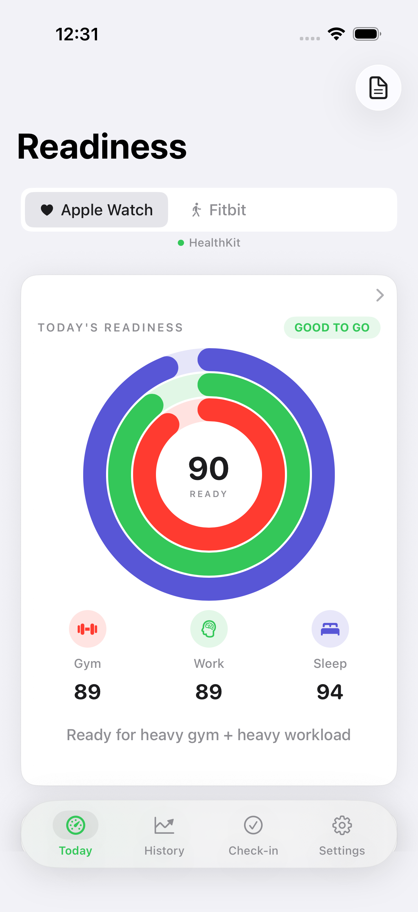
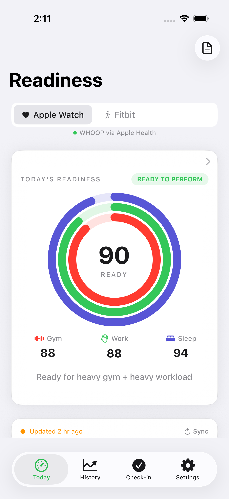
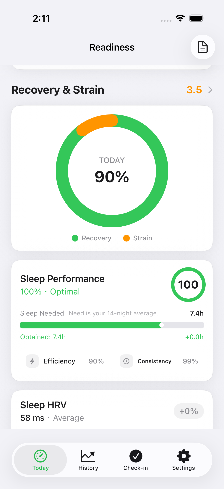
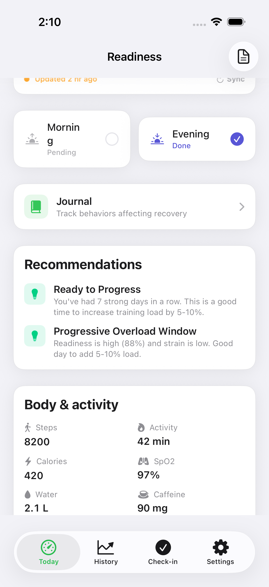
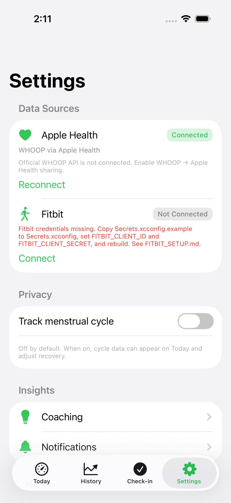

# ReadinessTracker

iOS readiness app. Bright Apple Health UI. Local HealthKit plus optional Fitbit. WHOOP product surfaces via Apple Health. No unofficial WHOOP OAuth.

**This branch (PR #15, includes #16):** Gym / Work / Sleep rings use Apple Activity radii. Today scroll keeps Morning and Evening above the tab bar. Body sits above the WHOOP stack.

Screenshots are Simulator captures from `./scripts/capture-surfaces.sh` (XCUITest swipe plus `-ui-fixture`, not VoiceOver).

## Status

| Surface | Status | Evidence |
|---|---|---|
| Today hero, Gym / Work / Sleep rings | Shipped. Concentric Activity geometry, one `-90` start, round caps, no tip dots, no hairline halo | [verify-rings.png](.audit/verify-rings.png) |
| Source chips + **WHOOP via Apple Health** | Shipped | [verify-dashboard.png](.audit/verify-dashboard.png) |
| Morning / Evening check-in cards | Shipped. First screen ends at the sync bar. Scrolled Today shows both cards above the tab bar. Morning still wraps on the half-card | dashboard + body frames |
| Recovery / Strain wheel | Shipped | [verify-whoop-stack.png](.audit/verify-whoop-stack.png) |
| Sleep Performance (14-night need) | Shipped. Efficiency and Consistency are one line | whoop frame |
| Sleep HRV (RMSSD) | Shipped. Header and 58 ms in the whoop frame. Trend / Sleep Quality chips sit below the chart | whoop frame |
| Sleep Debt | Present further down | UITest |
| Sleep Quality / Consistency cards | Present further down. One iPhone frame cannot hold Recovery through Consistency | UITest |
| Body & activity (steps, Activity min, calories, SpO2, water, caffeine, protein) | Shipped, **above** the WHOOP stack. Label is Activity, not Heart Points | [verify-body-activity.png](.audit/verify-body-activity.png) |
| Sleep disturbance count on Today sleep row | Shipped | `DashboardView` sleep card |
| Journal “log 7 days” strip | Shipped | `JournalView` |
| Settings connect / reconnect + cycle toggle off | Shipped | [verify-settings-sources.png](.audit/verify-settings-sources.png) |
| Official WHOOP API | Out of scope | Settings copy says so |
| Google Fit REST / “Heart Points” | Out of scope | Activity = minutes + calories |

## Supported features

Four tabs stay Today, History, Check-in, and Settings.

**Data.** Apple Health (HealthKit) is the default source. Fitbit is optional OAuth via gitignored `Secrets.xcconfig`. WHOOP values appear when the user shares WHOOP into Apple Health. `DataSource` is appleWatch or fitbit only.

**Today.** Readiness hero with Gym / Work / Sleep rings (`TripleRingHero`). Morning and Evening check-in. Journal. Recommendations. Body and activity (steps, Activity minutes, calories, SpO2, water, caffeine, protein). WHOOP stack (Recovery, Strain, Sleep Performance, Sleep HRV, Sleep Debt, Sleep Quality, Sleep Consistency). Sleep stages with disturbance count. Trends and score breakdown.

**Scores.** Recovery 0-100 from `RecoveryCalculator`. Strain TRIMP 0-21. Sleep need is the 14-night average from `BaselineManager`. HRV is RMSSD. Wheel recovery uses `RecoveryCalculator.dashboardWheelScore`.

**Check-in and journal.** Morning and Evening cards open Check-in for that time. Journal impact chart waits for 7 days of entries.

**Settings.** Apple Health Connect / Reconnect. Fitbit Connect / Refresh / Disconnect. Cycle tracking off by default. CSV export. Coaching and notification screens.

**Elsewhere.** History with weekly report. Home screen widgets and Watch complications (bright Apple Health tokens). Lock Screen widgets.

**Not in this app.** Unofficial WHOOP login. Google Fit REST. Heart Points.

## App surfaces

### Today

Bright grouped background. Dark selected Apple Watch chip. WHOOP-via-Health caption. Readiness 90 / Ready to perform. Rings match Activity packing. Sync bar sits above the tab bar.



### Triple rings

Same first screen, captured for ring geometry. Inner ring is no longer `size * 0.44`.



### Recovery, sleep performance, HRV

Scrolled Today after Body. Need caption is the 14-night average. Efficiency and Consistency do not wrap mid-word.



### Body and activity

Sits above Recovery and Strain. Label is **Activity**, not Heart Points. Morning and Evening are fully above the tab bar in this frame. Morning still wraps.



### Settings, data sources

Apple Health connected plus Reconnect. Fitbit Connect with missing-secrets error (expected without `Secrets.xcconfig`). Cycle tracking off.



## Verify

```bash
# Unit gate (CI)
DESTINATION='platform=iOS Simulator,name=iPhone 17 Pro' ./scripts/ci-verify.sh

# Scrolled surfaces → .audit/verify-*.png
./scripts/capture-surfaces.sh
```

`ci-verify.sh` runs `ReadinessTrackerTests` only. UI tests are `ReadinessTrackerUITests` (5 tests on iPhone 17 Pro, including `testTodayRingsGeometry`).

Do not commit `build/`, `build-DD/`, `Readiness.app`, or `Secrets.xcconfig`. The build recipe is `ReadinessTracker.xcodeproj` plus `scripts/*.sh`. There is no Makefile.

## Setup

- HealthKit on device. WHOOP data appears when the user shares WHOOP to Apple Health.
- Fitbit: copy `Secrets.xcconfig.example` to `Secrets.xcconfig`. See `FITBIT_SETUP.md` and `docs/DEVICE_SETUP.md`.
- App Group `group.com.readinesstracker` for widgets. See `docs/DEVICE_SETUP.md`.

## Honest gaps

1. Fifth capture frame for Sleep HRV chips plus Sleep Quality / Consistency cards, or keep UITest-only proof for that slice.
2. Morning wraps on the half-width check-in card.
3. Center “90 READY” makes a larger inner hole than Fitness Summary, which has no center score.
