# ReadinessTracker

iOS readiness app. Bright Apple Health UI. Local HealthKit plus optional Fitbit. WHOOP product surfaces via Apple Health. No unofficial WHOOP OAuth.

**main:** Gym / Work / Sleep rings use Apple Activity packing with a center READY score in a Fitness-scale hole; legend opens Fitness-style ring detail. Today Strain/Recovery Balance shows Recovery | Strain with deltas and a 7-day recovery spark. Sleep Performance shows Need | Got dual metrics. Recommendations use WHOOP-style actionable cards. Today scroll keeps Morning and Evening above the tab bar. Body sits above the WHOOP stack with Fitness-style progress tiles and tap-through detail.

Screenshots are Simulator captures from `./scripts/capture-surfaces.sh` (XCUITest swipe plus `-ui-fixture`, not VoiceOver).

## Status

| Surface | Status | Evidence |
|---|---|---|
| Today hero, Gym / Work / Sleep rings | Shipped. Concentric Activity geometry (`size/10` stroke, gap 2), packed center READY score, one `-90` start, round caps, no tip dots, no hairline halo | [verify-rings.png](.audit/verify-rings.png) |
| Ring detail (Gym / Work / Sleep) | Shipped. Legend taps open Fitness-style sheet: score, matching color/label, 7-day sparkline + mini bars from fixture history (Gym→workoutMinutes, Work→hrv, Sleep→sleepHours) | [verify-ring-detail.png](.audit/verify-ring-detail.png) |
| Source chips + **WHOOP via Apple Health** | Shipped | [verify-dashboard.png](.audit/verify-dashboard.png) |
| Morning / Evening check-in cards | Shipped. First screen ends at the sync bar. Scrolled Today shows both cards above the tab bar. Morning/Evening stay on one line on the half-card | dashboard + body frames |
| Check-in tab (Morning / Evening form) | Shipped. Dedicated capture opens the Check-in tab (segmented picker + Save) | [verify-checkin.png](.audit/verify-checkin.png) |
| History tab (Weekly Report + Trends) | Shipped. Dedicated capture opens the History tab (source picker, Weekly Report, Trends) | [verify-history.png](.audit/verify-history.png) |
| Recovery / Strain wheel | Shipped | [verify-whoop-stack.png](.audit/verify-whoop-stack.png) |
| Strain / Recovery balance (Today) | Shipped. Side-by-side Recovery % \| Strain /21 with day-over-day deltas; tappable → Recovery & Strain detail; 7-day recovery spark under the wheel | [verify-strain-recovery.png](.audit/verify-strain-recovery.png) |
| Recommendations (Today) | Shipped. WHOOP-style actionable cards (title, reason, action cue); training rules + coaching fill ≥1–3 under `-ui-fixture` | [verify-recommendations.png](.audit/verify-recommendations.png) |
| Coaching (Settings) | Shipped. Ranked insight cards with explanation + action; dedicated capture from Settings → Coaching | [verify-coaching.png](.audit/verify-coaching.png) |
| Sleep Performance (14-night need) | Shipped. Need \| Got dual metric + comparative bar (14-night need); Efficiency and Consistency stay one line | [verify-sleep-performance.png](.audit/verify-sleep-performance.png) |
| Sleep HRV (RMSSD) | Shipped. Tonight \| Baseline dual callout, delta, baseline band, 7-night sparkline; Sleep Quality one-liner | [verify-sleep-hrv.png](.audit/verify-sleep-hrv.png) |
| Sleep Debt | Shipped. Dedicated capture scrolls Today to the Sleep Debt card | [verify-sleep-debt.png](.audit/verify-sleep-debt.png) |
| Sleep Quality / Consistency cards | Shipped. Fifth capture scrolls to Sleep Quality Trend + Sleep Consistency | [verify-sleep-quality.png](.audit/verify-sleep-quality.png) |
| Body & activity (steps, Activity min, calories, SpO2, water, caffeine, protein) | Shipped, **above** the WHOOP stack. Elevated tiles: progress-to-goal + 7-day spark; tap → metric detail. Label is Activity, not Heart Points | [verify-body-activity.png](.audit/verify-body-activity.png) · [verify-body-detail.png](.audit/verify-body-detail.png) |
| Sleep disturbance count on Today sleep row | Shipped. Dedicated capture scrolls Today to Sleep Stages (“1 disturbance” under `-ui-fixture`) | [verify-sleep-disturbances.png](.audit/verify-sleep-disturbances.png) |
| Journal (seeded entries under fixture) | Shipped. `-ui-fixture` seeds ≥7 journal entries; capture opens Journal from Today (Recent Entries) | [verify-journal.png](.audit/verify-journal.png) |
| Journal Behavior Impact chart | Shipped. Fixture seed unlocks habit↔readiness impact (≥7 days); empty “Log 7 days” strip remains for real users with fewer entries | [verify-journal-impact.png](.audit/verify-journal-impact.png) |
| Weekly Report sheet (History) | Shipped. Dedicated capture opens History → Weekly Report (≥3 fixture days) | [verify-weekly-report.png](.audit/verify-weekly-report.png) |
| Sleep Analysis hypnogram (fixture stages) | Shipped. Fixture seeds coherent `sleepStages` (one awake) aligned with `wakeEpisodes`; capture opens Today → Sleep Stages → Sleep Analysis | [verify-sleep-stages.png](.audit/verify-sleep-stages.png) |
| Settings connect / reconnect + cycle toggle off | Shipped | [verify-settings-sources.png](.audit/verify-settings-sources.png) |
| Metric detail chart scrub (date + value callout) | Shipped. Drag scrub on `AdvancedMetricChartView` (score breakdown → detail): RuleMark + tooltip; period selector 7D/30D/90D/1Y; Reduce Motion skips scrub haptics | [verify-metric-detail-scrub.png](.audit/verify-metric-detail-scrub.png) |
| Classic `MetricDetailView` primary Trend scrub | Shipped. Today → Metrics cards open classic detail; `ChartScrubSelection` drag scrub + RuleMark/`ChartTooltip` on primary Trend chart (parity with Advanced) | [verify-metric-detail-classic-scrub.png](.audit/verify-metric-detail-classic-scrub.png) |
| Official WHOOP API | Out of scope | Settings copy says so |
| Google Fit REST / “Heart Points” | Out of scope | Activity = minutes + calories |

## Supported features

Four tabs stay Today, History, Check-in, and Settings.

**Data.** Apple Health (HealthKit) is the default source. Fitbit is optional OAuth via gitignored `Secrets.xcconfig`. WHOOP values appear when the user shares WHOOP into Apple Health. `DataSource` is appleWatch or fitbit only.

**Today.** Readiness hero with Gym / Work / Sleep rings (`TripleRingHero`); legend opens Fitness-style ring detail. Morning and Evening check-in. Journal. Recommendations. Body and activity (steps, Activity minutes, calories, SpO2, water, caffeine, protein) with progress-to-goal tiles and tap-through detail. WHOOP stack (Recovery, Strain, Sleep Performance, Sleep HRV, Sleep Debt, Sleep Quality, Sleep Consistency). Sleep stages with disturbance count. Trends and score breakdown.

**Scores.** Recovery 0-100 from `RecoveryCalculator`. Strain TRIMP 0-21. Sleep need is the 14-night average from `BaselineManager`. HRV is RMSSD. Wheel recovery uses `RecoveryCalculator.dashboardWheelScore`.

**Check-in and journal.** Morning and Evening cards open Check-in for that time. Journal impact chart waits for 7 days of entries (seeded under `-ui-fixture`).

**Settings.** Apple Health Connect / Reconnect. Fitbit Connect / Refresh / Disconnect. Cycle tracking off by default. CSV export. Coaching and notification screens.

**Elsewhere.** History with weekly report. Home screen widgets and Watch complications (bright Apple Health tokens). Lock Screen widgets.

**Not in this app.** Unofficial WHOOP login. Google Fit REST. Heart Points.

## App surfaces

### Today

Bright grouped background. Dark selected Apple Watch chip. WHOOP-via-Health caption. Readiness 90 / Ready to perform. Rings match Activity packing. Sync bar sits above the tab bar.


### Triple rings

Same first screen, captured for ring geometry. Concentric Activity diameters; center READY typography packs into a Fitness-Summary-scale hole (no longer an oversized empty core).


### Ring detail

Tap Gym / Work / Sleep on the hero legend. Sheet shows that ring’s score, matching color/label, and a 7-day sparkline + mini bars from `UIFixture` history (Gym → workout minutes, Work → HRV, Sleep → sleep hours).

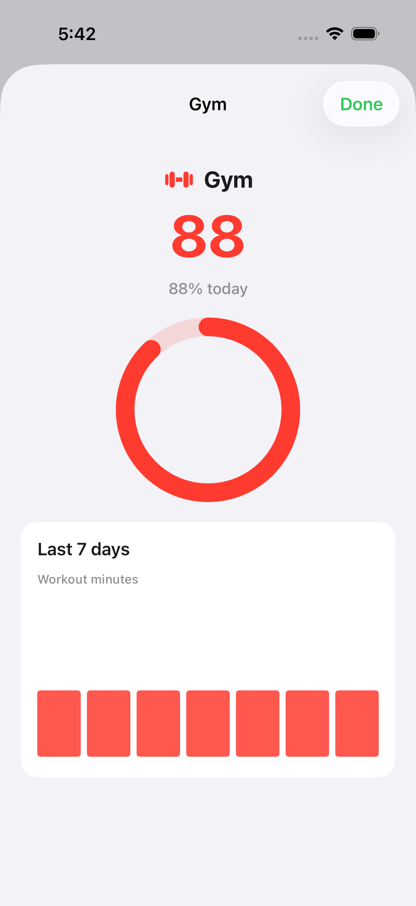

### Recovery, sleep performance, HRV

Scrolled Today after Body. Need caption is the 14-night average. Efficiency and Consistency do not wrap mid-word.


### Sleep Performance (Need vs Got)

WHOOP-like Sleep Performance card on Today: side-by-side **Need** and **Got** hours (14-night average vs last night), comparative bar with need marker, performance % ring. Efficiency / Consistency remain compact one-liners.

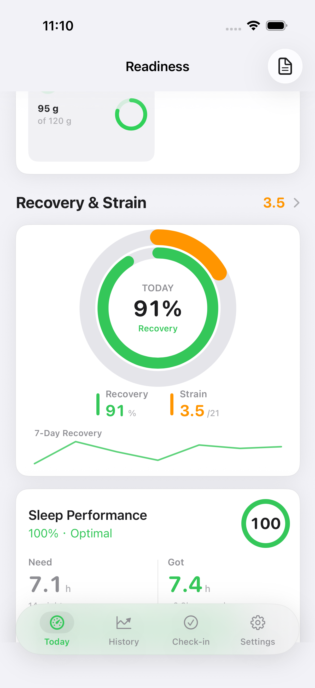

Tonight vs Baseline dual metric (ms RMSSD), % delta badge, ±10% baseline band on the trend chart, and a compact 7-night sparkline. Sleep Quality stays a one-liner. Metric-detail scrub for HRV already exists elsewhere.

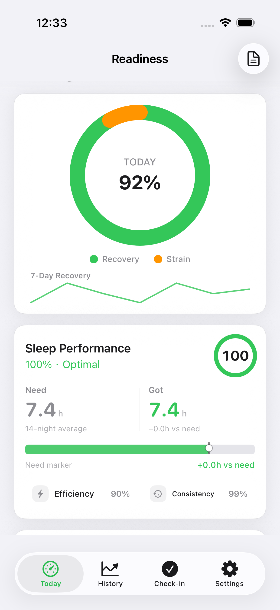

### Strain / Recovery balance

WHOOP-like Balance card on Today: Recovery % and Strain /21 side-by-side with day-over-day deltas, composite balance score, and tap-through to Recovery & Strain detail. A 7-day recovery spark sits under the wheel.

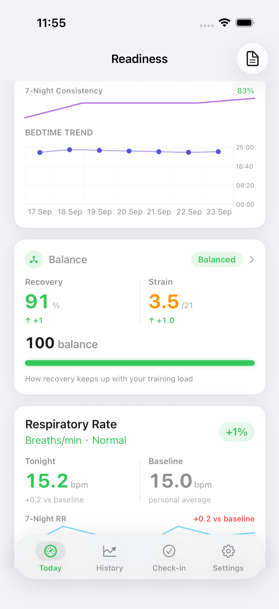

### Recommendations

Scrolled Today to Recommendations (after Journal). WHOOP-style cards with title, reason, and a concrete action cue. Under `-ui-fixture`, training rules plus coaching insights fill 1–3 cards from real fixture data (no placeholder copy).

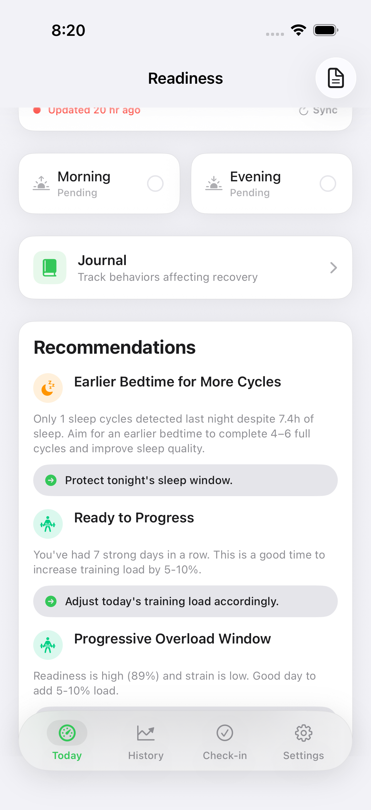

### Coaching

Opened from Settings → Insights → Coaching. Ranked coaching feed cards (explanation + action) under `-ui-fixture` — not the empty “No coaching insights yet” state.

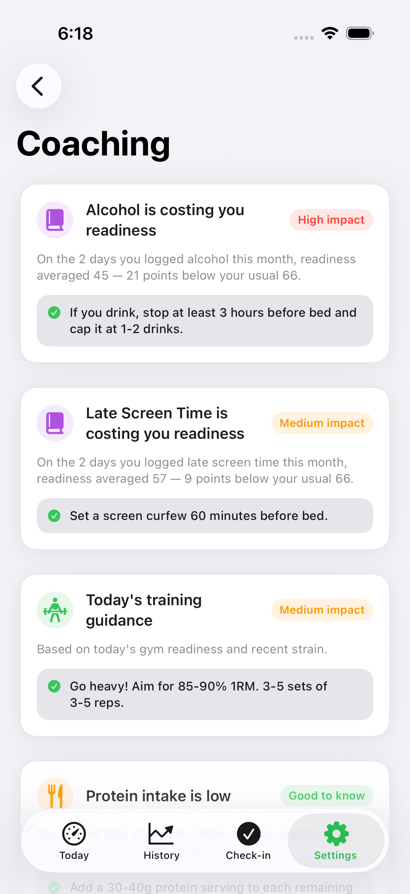

### Sleep debt

Scrolled Today to the Sleep Debt card (cumulative vs need). Sits after Sleep HRV and before Sleep Quality Trend.

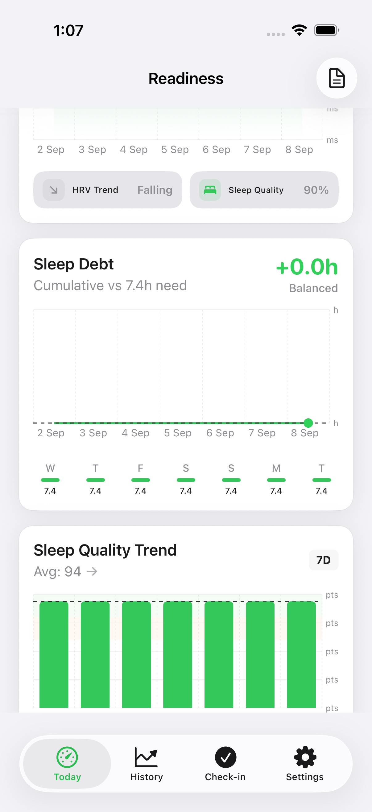

### Sleep quality and consistency

Scrolled further on Today past Sleep Debt. Sleep Quality Trend and Sleep Consistency cards (Sleep HRV chips when still in frame).

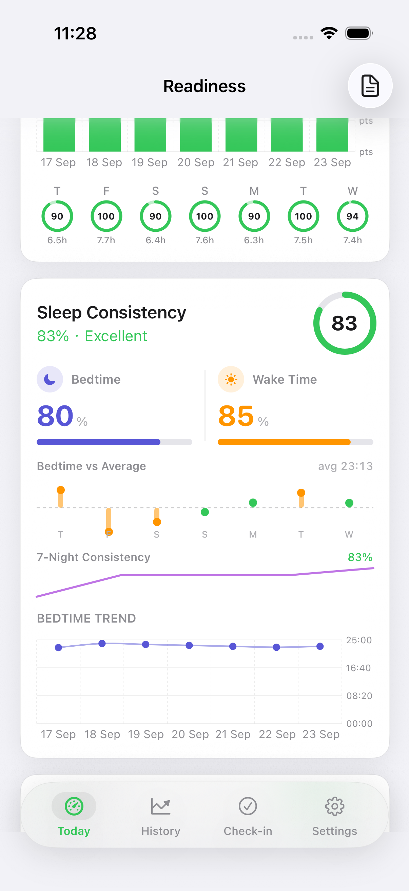

### Body and activity

Sits above Recovery and Strain. Elevated Fitness / Google Health–style tiles with progress-to-goal (Steps 10k, Activity 30 min, …) and 7-day sparklines. Tap a tile for focused metric detail. Label is **Activity**, not Heart Points. Morning and Evening are fully above the tab bar in this frame.


### Body metric detail

Tap Steps (or Activity / Calories / …) on Body & activity. Sheet shows today’s value, optional goal ring, and Last 7 days sparkline + mini bars from fixture history.

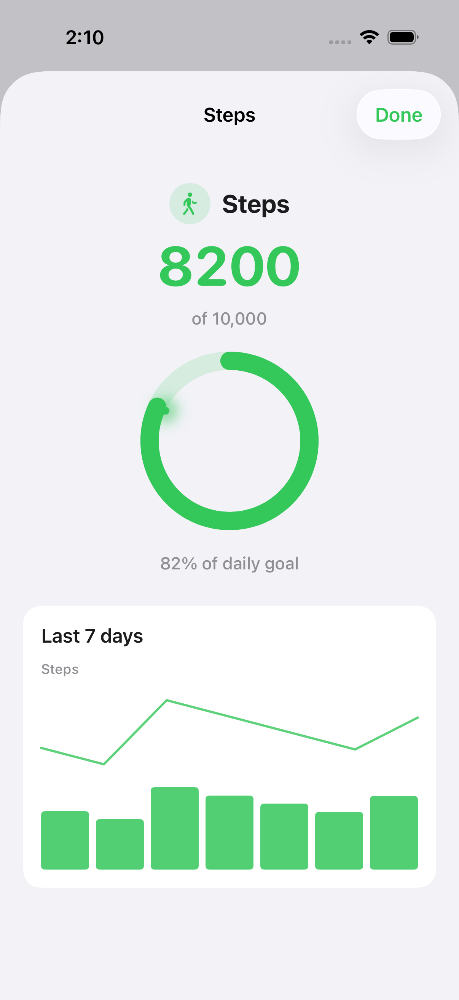


### Metric detail chart scrub

Today → Sleep (or HRV/RMSSD) metric card opens `MetricDetailView`. Drag across the primary Trend chart to inspect date + value (Apple Health / WHOOP style). Period selector matches Health-like 7D / 30D / 90D / 1Y controls. Score breakdown rows still open `AdvancedMetricDetailView` (bands / MA / outliers).

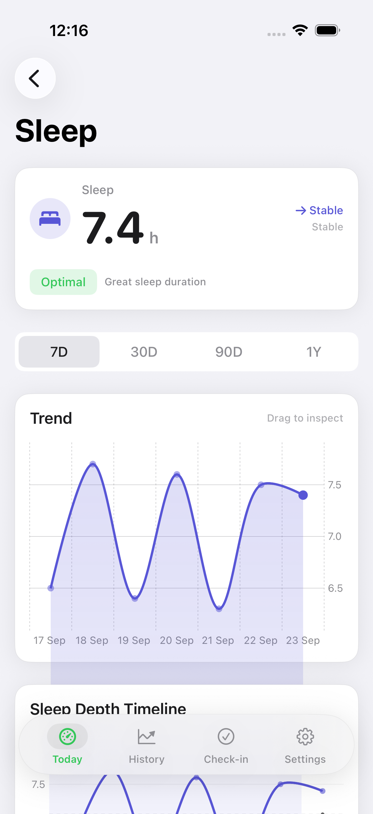

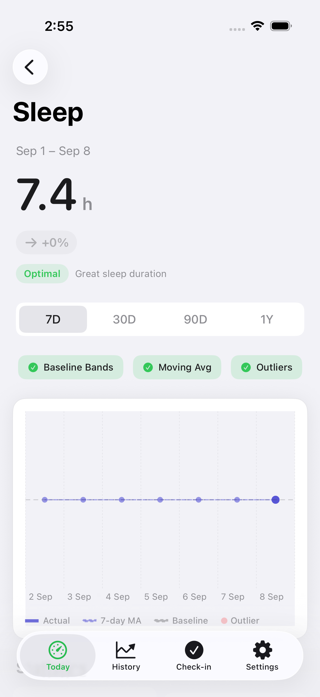

### Settings, data sources

Apple Health connected plus Reconnect. Fitbit Connect with missing-secrets error (expected without `Secrets.xcconfig`). Cycle tracking off.


### Check-in tab

Dedicated Check-in tab (not the Today Morning/Evening cards). Segmented Morning/Evening picker, Physical State form, and Save under `-ui-fixture`.

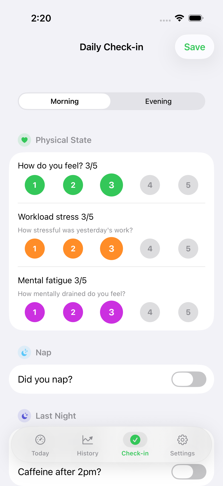

### History tab

Dedicated History tab. Segmented Apple Watch / Fitbit source picker, Weekly Report row, Trends section, and day list under `-ui-fixture` (14 seeded Apple Watch days).

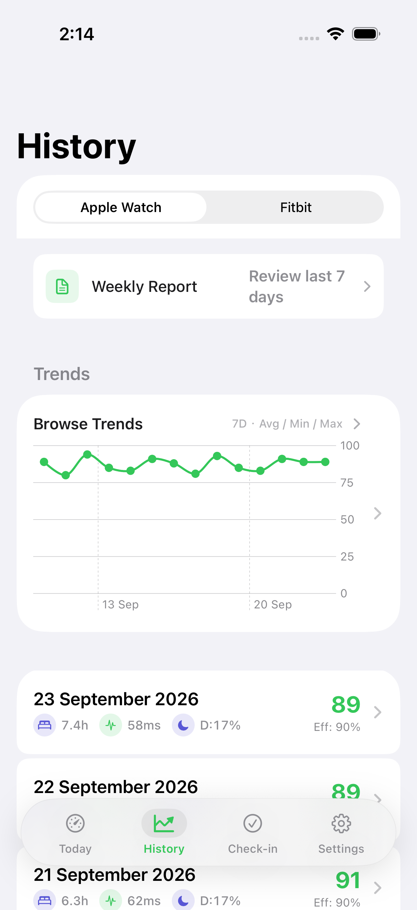

### Weekly Report

Opened from History’s Weekly Report row. Sheet shows avg readiness, trend, stat grid, Highlights/Recommendations, and Share Report under `-ui-fixture` (14 seeded days → generator needs ≥3).

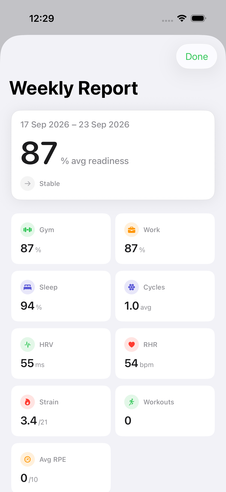

### Journal

Opened from Today’s Journal row. Under `-ui-fixture`, ≥7 seeded entries show Recent Entries (real users with fewer than 7 days still see the empty “Log 7 days…” strip).

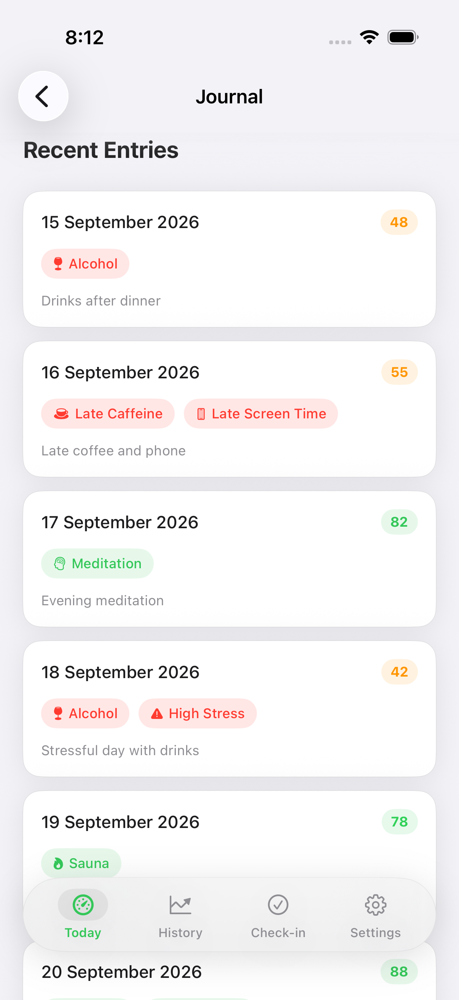

### Journal Behavior Impact

Same Journal screen scrolled to the Behavior Impact card. Fixture habits (alcohol, caffeine, recovery) line up with readiness scores so the chart is non-empty.

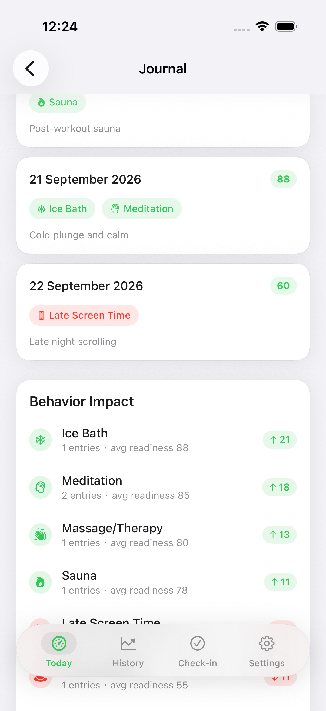

### Sleep disturbances

Scrolled Today to the Sleep Stages card. Fixture derives `wakeEpisodes` from one awake stage interval so “1 disturbance” matches hypnogram / Day Detail (accessibility label “Sleep disturbances”).

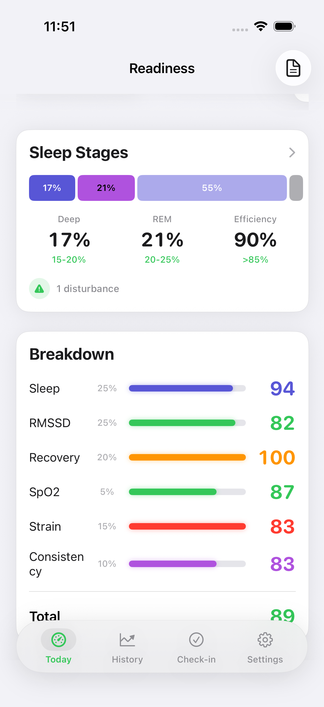

### Sleep stages hypnogram

Opened from Today’s Sleep Stages card into Sleep Analysis. Under `-ui-fixture`, seeded stage intervals render the Sleep Timeline hypnogram (not the empty “No detailed stage data” state), with disturbance count derived from those stages.

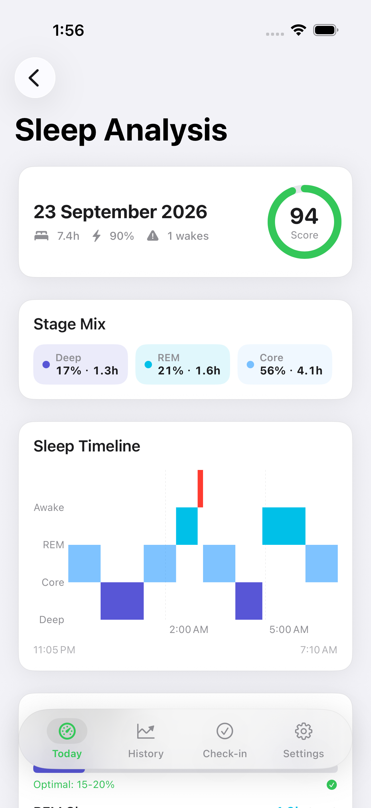

## Verify

Push and pull request to `main` run three required GitHub Actions jobs.

1. Tree guard (`./scripts/ci-guard-tree.sh`). Fails if git tracks `build/`, `Readiness.app`, `Secrets.xcconfig`, `xcuserdata`, or `Heart Points` in Swift. Also fails if a committed `.audit/verify-*.png` is missing.
2. iOS unit tests (`./scripts/ci-verify.sh`). `ReadinessTrackerTests` only.
3. iOS UI surfaces (`./scripts/capture-surfaces.sh`). UITests with `-ui-fixture` (including classic MetricDetailView scrub). PNGs upload as the `ui-surfaces` artifact.

```bash
./scripts/ci-guard-tree.sh

DESTINATION='platform=iOS Simulator,name=iPhone 17 Pro' ./scripts/ci-verify.sh

DESTINATION='platform=iOS Simulator,name=iPhone 17 Pro' ./scripts/capture-surfaces.sh
```

Do not commit `build/`, `build-DD/`, `Readiness.app`, or `Secrets.xcconfig`. The build recipe is `ReadinessTracker.xcodeproj` plus `scripts/*.sh`. There is no Makefile.

## Setup

- HealthKit on device. WHOOP data appears when the user shares WHOOP to Apple Health.
- Fitbit: copy `Secrets.xcconfig.example` to `Secrets.xcconfig`. See `FITBIT_SETUP.md` and `docs/DEVICE_SETUP.md`.
- App Group `group.com.readinesstracker` for widgets. See `docs/DEVICE_SETUP.md`.

## Honest gaps

1. ~~Fifth capture frame for Sleep HRV chips plus Sleep Quality / Consistency cards.~~ Closed — [verify-sleep-quality.png](.audit/verify-sleep-quality.png) from `testSleepQualitySurfaceVisibleAfterScroll`.
2. ~~Morning wraps on the half-width check-in card.~~ Closed — Morning/Evening use `lineLimit(1)` + `minimumScaleFactor` on the half-width cards.
3. ~~Center “90 READY” makes a larger inner hole than Fitness Summary, which has no center score.~~ Closed — tighter Activity packing (`size/10` stroke, gap 2) plus scaled center READY typography; see [verify-rings.png](.audit/verify-rings.png).
4. ~~Sleep Debt Status row was “Present further down | UITest” with no dedicated frame.~~ Closed — [verify-sleep-debt.png](.audit/verify-sleep-debt.png) from `testSleepDebtSurfaceVisibleAfterScroll`.
5. ~~Check-in tab had no dedicated UITest/PNG (only Today Morning/Evening cards).~~ Closed — [verify-checkin.png](.audit/verify-checkin.png) from `testCheckInTabSurface`.
6. ~~History tab had no dedicated UITest/PNG (only mentioned under Elsewhere).~~ Closed — [verify-history.png](.audit/verify-history.png) from `testHistoryTabSurface`.
7. ~~Journal “log 7 days” strip Status row cited `JournalView` with no PNG.~~ Closed — [verify-journal.png](.audit/verify-journal.png) from `testJournalSurface` (fixture now seeds ≥7 entries; empty strip remains for real users with <7 days).
14. ~~Journal Behavior Impact chart only showed after 7 real days; fixture permanently showed “Log 7 days…”.~~ Closed — `UIFixture.seedJournalEntries` (≥8 entries with readiness scores); [verify-journal-impact.png](.audit/verify-journal-impact.png) from `testJournalImpactSurface`.
8. ~~Sleep disturbance count Status row cited `DashboardView` with no PNG.~~ Closed — [verify-sleep-disturbances.png](.audit/verify-sleep-disturbances.png) from `testSleepDisturbanceSurfaceVisibleAfterScroll`.
9. ~~Weekly Report sheet had History row only (no PNG of the report itself).~~ Closed — [verify-weekly-report.png](.audit/verify-weekly-report.png) from `testWeeklyReportSurface`.
10. ~~UIFixture set `wakeEpisodes: 1` with empty `sleepStages`, so Today showed “1 disturbance” while Sleep Analysis / Day Detail hypnogram and `awakePeriods(from:)` were empty; hypnogram Y also used positive `depthRank` outside `chartYScale` `-4...0`.~~ Closed — fixture seeds coherent stages (one awake) and derives `wakeEpisodes` from them; HypnogramView uses negated Y bands; [verify-sleep-stages.png](.audit/verify-sleep-stages.png) from `testSleepStagesSurface`.
11. ~~Metric detail trend charts were tap-only (or no scrub callout) vs Apple Health / WHOOP drag-to-inspect.~~ Closed — `AdvancedMetricChartView` drag scrub + RuleMark/tooltip; [verify-metric-detail-scrub.png](.audit/verify-metric-detail-scrub.png) from `testMetricDetailChartScrubSurface`; unit tests cover `ChartScrubSelection`.
12. ~~Classic `MetricDetailView` primary Trend chart remained tap-only while Advanced had Health-style scrub.~~ Closed — `ChartScrubSelection` drag scrub + RuleMark/`ChartTooltip` on `MetricDetailView`; Metrics cards open classic detail; [verify-metric-detail-classic-scrub.png](.audit/verify-metric-detail-classic-scrub.png).
13. ~~Gym / Work / Sleep legend was display-only (no Fitness-style focused ring detail).~~ Closed — legend taps open `RingDetailView` sheet (score + color + 7-day sparkline/bars); [verify-ring-detail.png](.audit/verify-ring-detail.png) from `testRingDetailSurface`.
15. ~~Today Balance card was a single abstract score (no side-by-side Strain vs Recovery, not tappable, no recovery spark under the wheel).~~ Closed — elevated `StrainRecoveryBalanceCard` + NavigationLink + 7-day spark; [verify-strain-recovery.png](.audit/verify-strain-recovery.png) from `testStrainRecoveryBalanceSurface`.
16. ~~Today Recommendations were thin title+description only (easy to miss / empty under healthy fixture); Coaching had no dedicated PNG.~~ Closed — WHOOP-style actionable cards via `morningActionableCards` (training + coaching fill); [verify-recommendations.png](.audit/verify-recommendations.png) + [verify-coaching.png](.audit/verify-coaching.png).
17. ~~Sleep Performance Status cited only “whoop frame” — Efficiency/Consistency one-liners without a clear Need vs Got morning glance or dedicated PNG.~~ Closed — elevated Need \| Got dual metric + comparative bar; [verify-sleep-performance.png](.audit/verify-sleep-performance.png) from `testSleepPerformanceSurface`.
18. ~~Body & activity tiles were plain labels (no progress-to-goal, no sparkline, no tap-through detail) vs Google Health / Fitness glance.~~ Closed — elevated `BodyMetricTile` + `BodyMetricDetailView`; [verify-body-activity.png](.audit/verify-body-activity.png) + [verify-body-detail.png](.audit/verify-body-detail.png) from `testBodyActivityVisibleAfterScroll` / `testBodyDetailSurface`.
19. ~~Sleep HRV Status cited only whoop/sleep-quality frames — thin header + chips without a clear Tonight vs Baseline glance, baseline band, 7-night spark, or dedicated PNG.~~ Closed — elevated Tonight \| Baseline dual callout + band + spark; [verify-sleep-hrv.png](.audit/verify-sleep-hrv.png) from `testSleepHRVSurface`.
